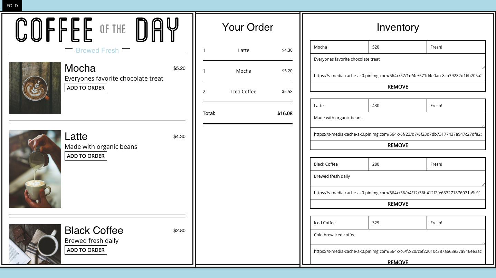

<b>Get going with your simple react coffee menu:</b>
 
cd into 'coffee-of-the-day' 
'npm install' 
run 'gulp' 

 
 

 
 

<b>What you can do:</b>
 
- Create new inventory items 
- Remove inventory items 
- Update existing inventory item info 
- Add items from menu to your ticket 
- Remove items from your ticket 
